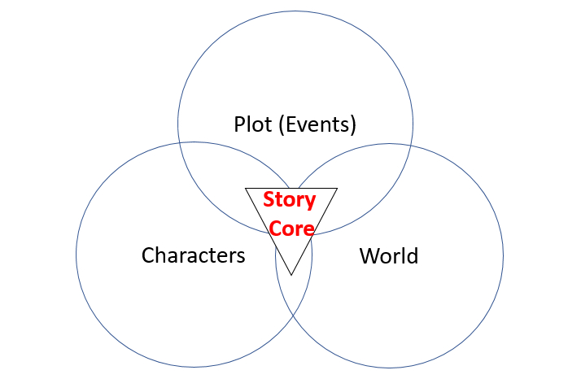

# What makes a story?

All stories are essentially made up of three main components
- Characters
- Setting (or World)
- Events (or Actions)

## Characters

Character building is the development of fictional characters in the story. This could be anything related to:
- backstory
- appearance
- psychology
- relations and interactions with other characters
- transformations and character development over time

There are many different types of characters, e.g.:
- Protagonist (main character)
- Antagonist (main villain that opposes the main character)
- Supporting characters (sidekicks, mentors, extras)

Characters are important because they carry out the actions in your story. Your characters have to be relatable to the audience.

## World 

World building is the process of designing a fictional universe that enables characters, events and actions to take place. It needs to be sufficiently detailed to increase the level of immersion and improve the experience of the audience.

A good story world is built when:
- It allows for the fictional characters to exist
- Allows the characters to interact, and do what they are supposed to do in the story
- Allows the audience to experience realism of the world

Successful character and world building requires a clear exposition. An exposition states the facts, creates a sufficiently detailed backstory, and establishes the context of the story to the audience. Most importantly, it lays the foundation of what is normal or realistic in the story. An exposition is usually at the beginning of the story, or established right before important events in the story.

Facts are inherently not interesting, but they are important for audiences to understand what is going on, what is the context, and why are things the way they are. 

## Events

Events are the actions that take place in the story. A story is usually made up of many micro-events that contributes to a macro-event. Multiple macro-events put together in a particular sequence creates the plot (the sequence of events that unfold through the telling of the story).

Some events are more important than others. Events bring about tension and conflict, either within a character or between characters. Tension gets the audience interested and look forward to what will happen next.

At the center of all stories, there is a 'story core' - the main central challenge/problem/opportunity that drives the story forward. 

When we piece together all the components, we can visualize a story as having these components:

Next Section: Paying Attention to your Audience

[Home](markdowns/readme.md)
